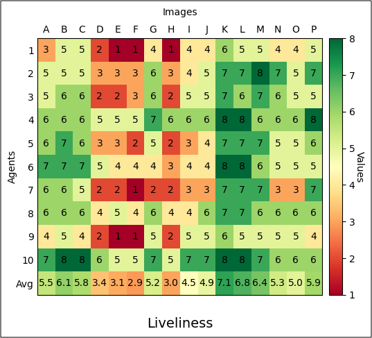

# Generative agents: Testing its capability in movement and urban perception based tasks

## Overview

This study employs LLMs to simulate human behavior in two tasks: assessing generative agents' effectiveness in processing visual information and movement for navigating urban representations. 
A generative agent framework with visual, movement, and memory modules is designed to observe visual stimuli. The agents, each with distinct personalities, 
locate a 'restaurant' using stored memories. The study also evaluates perceptual attributes, safety, and liveliness of scenes using Google Street View imagery and vision models, 
with chatgpt-3.5 as the LLM..

## Table of Contents

- [Project Title](#project-title)
  - [Overview](#overview)
  - [Table of Contents](#table-of-contents)
  - [Prerequisites](#prerequisites)
  - [Installation](#installation)
  - [GenAI Agent Framework](#genai-agent-framework)
  - [Outputs](#outputs)
  - [Acknowledgements](#acknowledgements)

## Prerequisites

- An OpenAI API access through API key. The framework can be run with Open LLMs as well, however the prompts need to change and results might differ widely.
- A Google Street View API key to fetch street view images.

## Installation

- The code was run on Windows 11 with no specific requirements other than Pytorch which is required for several visual foundational models.
- A environment file [`langchain_environment.yml`](langchain_environment.yml) is supplied with the addtional inormation on versions of libraries in which the code was run.

## GenAI Agent Framework

## 1. Bi-directional Graph Creation

The study initiates with the construction of a bi-directional graph, utilizing GSV API-based URLs as node attributes and incorporating directional information (right/left/forward/backward) as edge data. The code implementation is provided in [`topo_graph.ipynb`](topo_graph.ipynb).

## 2. Agent Framework Development [Other Jupyter Notebooks will be added shortly!]

The agent framework is created, integrating LangChain boilerplate code and memory modules inspired by the work of [Park, Joon Sung, et al.](https://dl.acm.org/doi/abs/10.1145/3586183.3606763). The framework encompasses prompts, logic, and memory components. The [`generative_agent.py`](generative_agents/generative_agent.py) script establishes the overall structure, while [`memory.py`](generative_agents/memory.py) is responsible for creating the memory module. The [`lang.ipynb`](lang.ipynb) notebook provides a working structure of the developed agent framework.

## 3. Visual Foundational Models 

Foundational models dedicated to tasks like Segmentation, Classification, and Object Detection are employed. The relevant files are stored in [`image_description/`](image_description/). Agents utilize the constructed graph to retrieve images, and the visual inference models decode the information embedded within these images.

Navigating through these fundamental components, GenAI agents play a crucial role in the study's exploration and analysis. The interlinking of these modules help emulate human visual and movement behavior in the limited data provided. 

## Outputs

  
   
  <em>The 15-step runs by the agent to find the tree-house in the city.</em>

  
   
  <em>The liveliness ratings provided by the agents for specific locations.</em>

  
   
  <em>An excerpt of the agents' preferences regarding decision of movement between two locations.</em>

## Acknowledgements

I would like to express my gratitude to the creators and contributors of the following libraries, whose invaluable tools significantly contributed to the success of this project:

   - [generative_agents](https://github.com/joonspk-research/generative_agents) and the associated study was significant part of this work.

   - [langchain](https://github.com/langchain-ai/langchain) provided boilerplate code necessary for the creation of overall framework.

I am deeply appreciative of the open-source community and the developers behind these libraries for their dedication and the exceptional work they have done. Their contributions have enriched this project and made it possible to achieve its goals efficiently.

## Citing this work

- Verma, Deepank, Olaf Mumm, and Vanessa Miriam Carlow. "Generative agents in the streets: Exploring the use of Large Language Models (LLMs) in collecting urban perceptions." arXiv preprint arXiv:2312.13126 (2023) [Link to the Paper](https://arxiv.org/abs/2312.13126).
